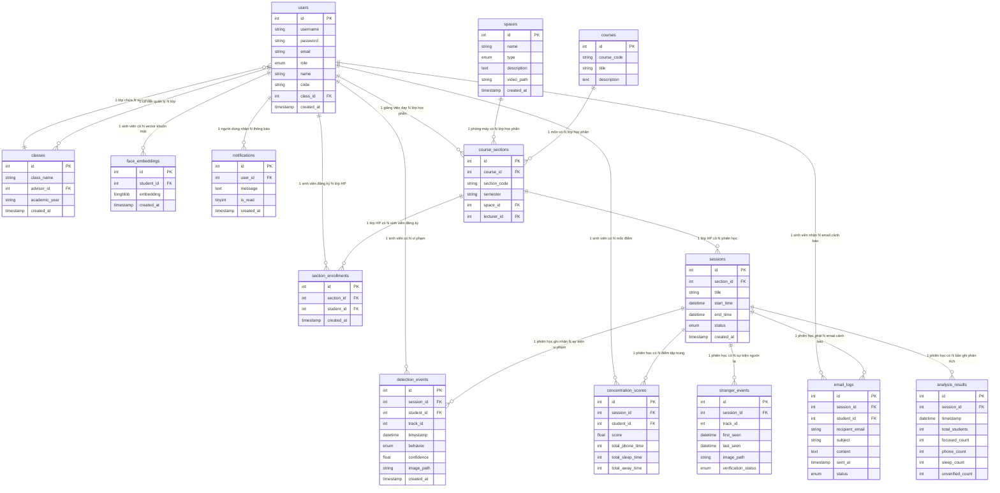

# Sơ đồ Thực thể Mối quan hệ (ERD - Entity Relationship Diagram) Database `focus_db`

Tài liệu này cung cấp sơ đồ ERD đã được chuẩn hóa, phân nhóm khoa học và trình bày rõ ràng các mối quan hệ (1 - N) giữa 14 bảng trong hệ thống **Focus System**, giúp thay thế hình ảnh ERD cũ bị chồng chéo đường nối.

---

## 1. Hình ảnh Sơ đồ ERD Mẫu (Kiểu dáng Chuẩn hóa)

---

## 2. Sơ đồ Mermaid ERD (Dành cho Xem Trực quan / Chỉnh sửa)

---

## 3. Bảng Phân loại Mối quan hệ Chi tiết (Chi tiết Khóa ngoại - FK)

| Bảng nguồn | Bảng liên kết (FK) | Loại mối quan hệ | Ý nghĩa nghiệp vụ |
| :--- | :--- | :---: | :--- |
| `classes` | `users(advisor_id)` | **1 - N** | Một giảng viên cố vấn có thể chủ nhiệm nhiều lớp sinh hoạt. |
| `users` | `classes(class_id)` | **1 - N** | Một lớp sinh hoạt chứa nhiều tài khoản sinh viên. |
| `course_sections` | `courses(course_id)` | **1 - N** | Một môn học có thể mở nhiều lớp học phần khác nhau. |
| `course_sections` | `spaces(space_id)` | **1 - N** | Một phòng máy/phòng học diễn ra nhiều lớp học phần. |
| `course_sections` | `users(lecturer_id)` | **1 - N** | Một giảng viên phụ trách giảng dạy nhiều lớp học phần. |
| `section_enrollments`| `course_sections(section_id)` `users(student_id)` | **N - N** | Bảng trung gian thể hiện sinh viên đăng ký học các lớp học phần. |
| `sessions` | `course_sections(section_id)` | **1 - N** | Một lớp học phần tổ chức nhiều buổi/phiên giám sát. |
| `face_embeddings` | `users(student_id)` | **1 - N** | Lưu các vector nhúng nhận diện khuôn mặt ArcFace của từng sinh viên. |
| `detection_events` | `sessions(session_id)` `users(student_id)` | **1 - N** | Lưu từng sự kiện AI phát hiện hành vi mất tập trung (dùng ĐT, ngủ gật). |
| `stranger_events` | `sessions(session_id)` | **1 - N** | Lưu nhật ký phát hiện đối tượng chưa xác minh / người lạ. |
| `analysis_results` | `sessions(session_id)` | **1 - N** | Lưu chỉ số phân tích định kỳ tổng hợp của cả lớp theo mốc thời gian. |
| `concentration_scores`| `sessions(session_id)` `users(student_id)` | **1 - N** | Lưu kết quả điểm Focus Score cá nhân sau mỗi phiên học. |
| `email_logs` | `sessions(session_id)` `users(student_id)` | **1 - N** | Lưu nhật ký email cảnh báo tự động gửi cho sinh viên/giảng viên. |
| `notifications` | `users(user_id)` | **1 - N** | Lưu thông báo chuông hiển thị trên Web/Mobile. |
